# 🐳 Mastering Docker: A Practical & Interview-Ready Guide

> Your complete guide to understanding Docker — from basics to advanced features — with interview-aligned insights, real-world workflows, and developer-friendly examples. Includes **Kubernetes**, **orchestration concepts**, and **real-world scenarios** to ace interviews and build production-grade applications.

---

## 📦 What are Containers?

Containers are **lightweight, portable environments** that package software and all its dependencies to run reliably in different computing environments.

### ✅ Benefits:

* 🧩 **Isolation** – Each container runs in its own namespace
* 🔁 **Consistency** – Dev = Test = Prod
* 🚀 **Speed** – Faster boot times than VMs
* 📦 **Efficiency** – Less overhead due to shared OS kernel

🧠 **Analogy**: Think of containers as shipping containers — standard size, stackable, and can carry anything from one ship (host) to another, safely and uniformly.

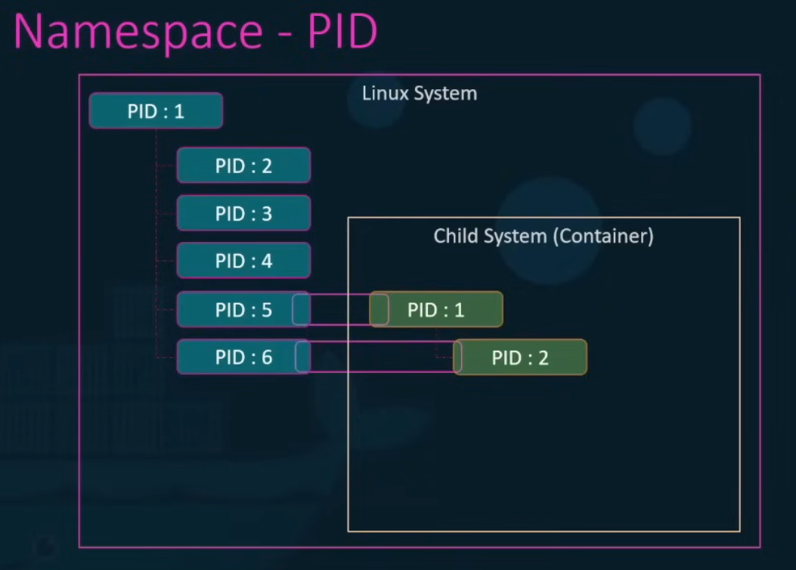

---

## 🧱 Bare Metal vs VM vs Container

### 🔧 Case Study:

Stack: `Node.js` + `MongoDB` + `Redis` + `Ansible`

### 🚫 Bare Metal (Legacy approach)

* ❌ Host-level conflicts (e.g., different Python versions)
* ❌ Difficult rollback and reproducibility
* ❌ Full system crashes affect all apps

### 💻 Virtual Machines

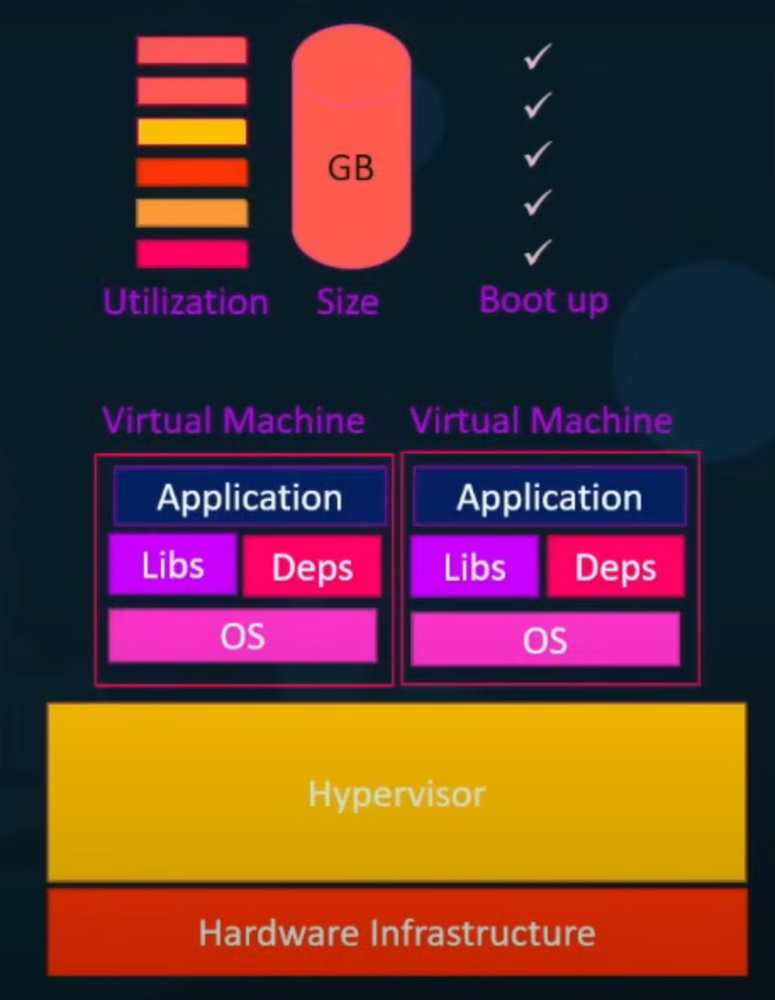

* ✅ OS-level isolation
* 🌀 Slower boots, heavy memory usage
* 🔒 Uses **Hypervisor** (e.g., VMware, KVM, VirtualBox)

### 📦 Containers

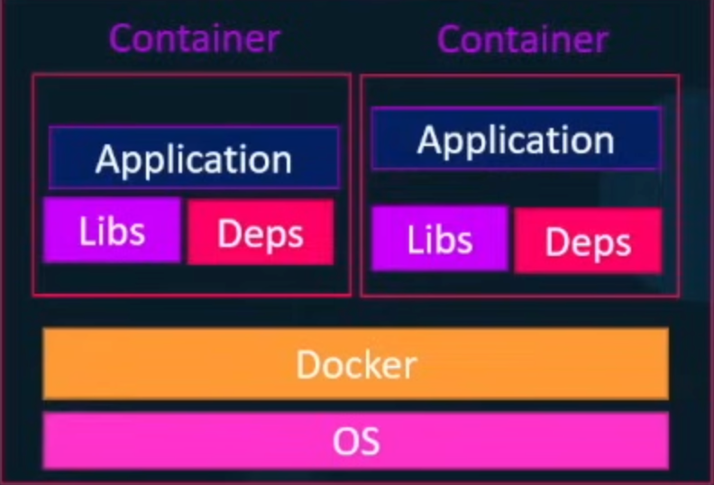

* 🧠 Share host kernel → lightweight
* 🔄 Immutable infrastructure
* ⏱️ Boot in milliseconds

### 🧬 Hybrid Setup

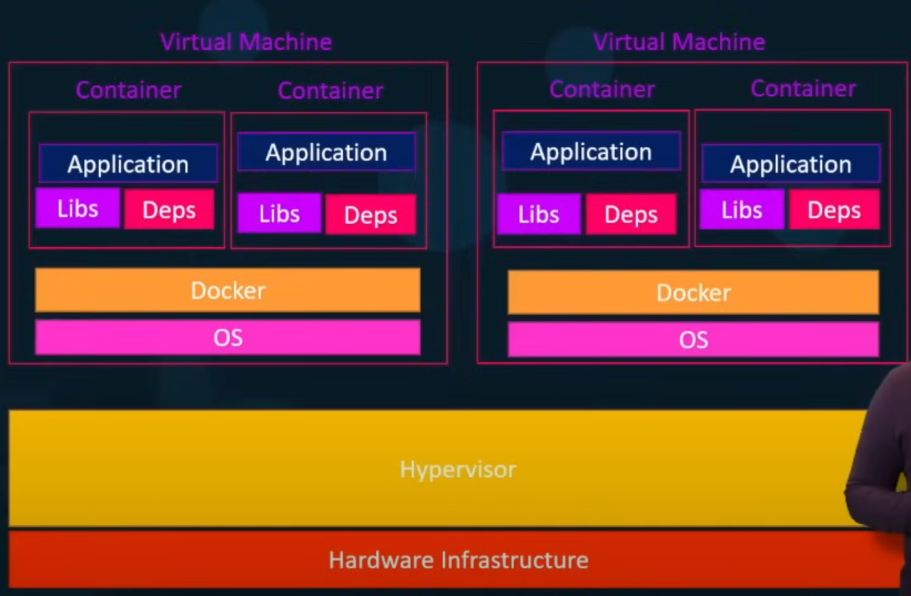

* VMs for **security zones**; containers for **speed**

🧠 **Real-World**: Most **cloud providers** (AWS ECS, Azure ACI, GCP Cloud Run) use containers inside VMs for balance of speed and isolation.

---

## 🧩 OCI Specifications (Open Container Initiative)

* **Runtime**: E.g., `runc` – executes containers
* **Image**: Format for packaging applications
* **Distribution**: How images are pushed/pulled (DockerHub, ECR, GCR)

---

## 🗣️ Core Docker Terminology

| Term                 | Description                  |
| -------------------- | ---------------------------- |
| **DockerHub**        | Global image registry        |
| **Dockerfile**       | Instructions to build images |
| **Docker Image**     | Blueprint (read-only)        |
| **Docker Container** | Running instance of an image |

🧠 **Interview Insight**: A container dies when its main process exits — always configure `ENTRYPOINT` or `CMD` correctly.

---

## 🛠️ Docker CLI Essentials

### 🚀 Running Containers

```bash
docker run -it -p 8080:80 nginx
```

Common flags:

* `-d`: Detached mode
* `-it`: Interactive Terminal
* `-p`: Port mapping (host\:container)

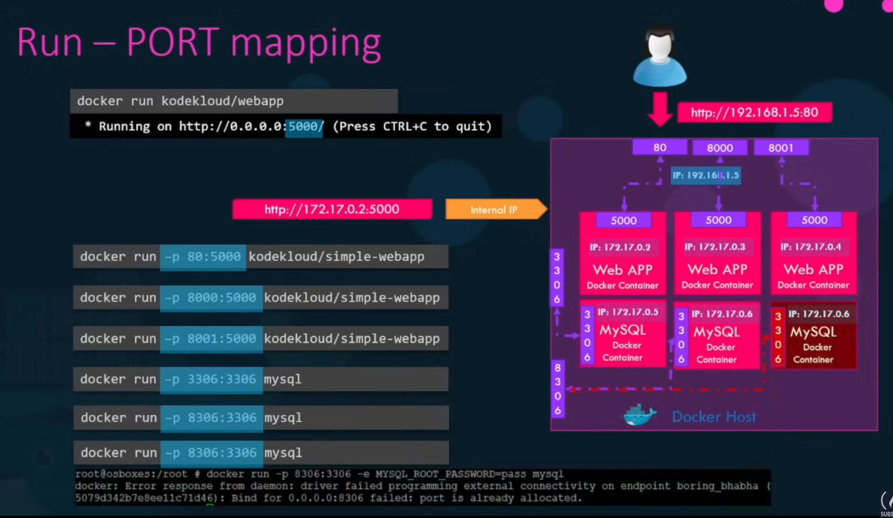

* `-e`: Environment variables
* `-v`: Volume mapping – persist or share data

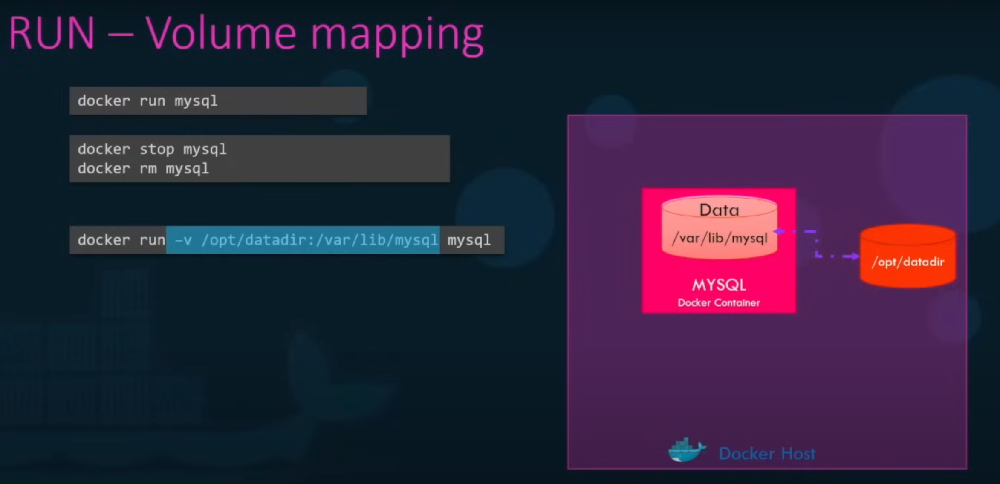

### 🔍 Debugging Tools

```bash
docker logs <container>
docker exec -it <container> /bin/bash
docker inspect <container>
```

---

## 🔨 Creating Docker Images

### 🧪 Sample Dockerfile

```dockerfile
FROM ubuntu:22.04
ENV ENV=prod
RUN apt update && apt install -y python3-pip
RUN pip install flask
COPY . /app
WORKDIR /app
CMD ["python3", "app.py"]
```

🧠 **Best Practice**: Use multi-stage builds to reduce image size.

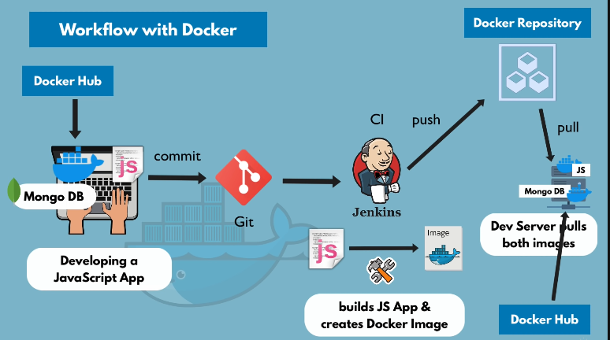

### 📦 Build & Push Workflow

```bash
docker build -t your-image:latest .
docker tag your-image yourdockerhub/your-image

docker push yourdockerhub/your-image
```

---

## 🌐 Docker Networking

### 🔗 Modes

| Network Type         | Use Case                                |
| -------------------- | --------------------------------------- |
| **bridge** (default) | Inter-container communication           |
| **host**             | Max performance (shares host net stack) |
| **none**             | Isolated network                        |

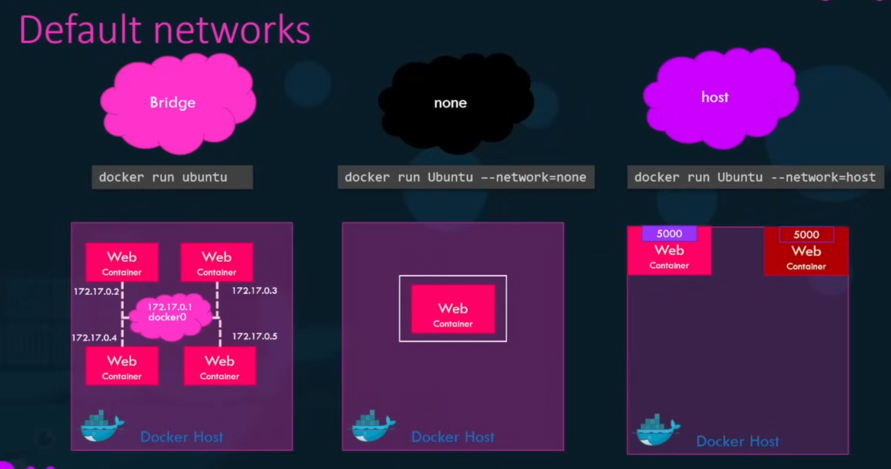

🧠 Docker uses internal DNS (127.0.0.11) to resolve container names.

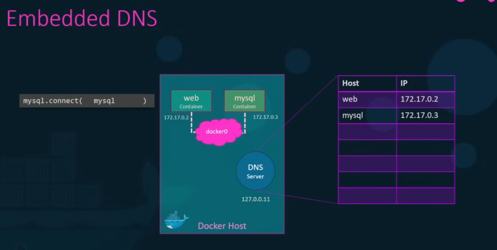

🔧 Create a custom bridge:

```bash
docker network create --driver bridge my-net
```


---

## 💾 Docker Storage

### 🧠 Concepts

* **Image Layer (immutable)**: base + dependencies
* **Container Layer (mutable)**: user-level changes

### 🔄 Storage Types

| Type           | Description              |
| -------------- | ------------------------ |
| **Volume**     | Managed by Docker        |
| **Bind Mount** | Points to host directory |

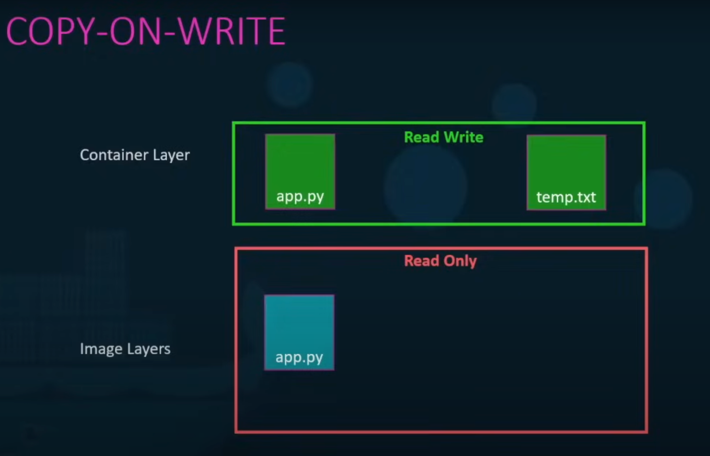

### Examples:

```bash
docker volume create data-vol
docker run -v data-vol:/data mysql

docker run --mount type=bind,source=/host,target=/data nginx
```

---

## 🧩 Docker Compose – Multi-Container Apps

```bash
docker-compose up -d
docker-compose down
```

📄 `docker-compose.yaml`

```yaml
version: '3'
services:
  backend:
    build: ./backend
    ports:
      - "5000:5000"
    depends_on:
      - redis
  redis:
    image: redis
```

🧠 Compose files define service topology and orchestration logic — great for microservices.

---

## 📤 Docker Private Registry

```bash
docker run -d -p 5000:5000 --name registry registry

docker tag my-image localhost:5000/my-image
docker push localhost:5000/my-image
```

Used in **CI/CD pipelines** for image caching and internal distribution.

---

## ☸️ Kubernetes (K8s) – Container Orchestration

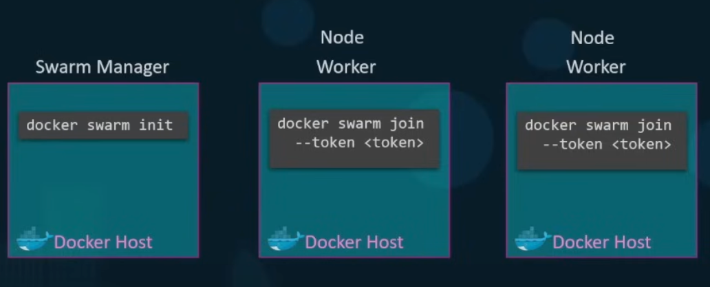

Kubernetes automates:

* 🚀 **Deployment**
* 🔁 **Scaling**
* ♻️ **Self-healing**
* 🌐 **Service Discovery**

### ⚙️ Key Components:

| Component      | Description                               |
| -------------- | ----------------------------------------- |
| **Pod**        | Smallest unit — wrapper around containers |
| **Service**    | Network abstraction over Pods             |
| **Deployment** | Declarative update strategy               |
| **Node**       | A worker machine                          |
| **Cluster**    | Group of nodes                            |

🧠 **Interview Tip**: “Kubernetes ensures **desired state** of the system via its control loop.”

### 🔁 Workflow

1. Define a YAML manifest
2. Apply it: `kubectl apply -f app.yaml`
3. Monitor: `kubectl get pods`

### 📦 Real-World Usage:

* Netflix, Spotify, and Airbnb run 1000s of microservices on K8s.
* Use Helm Charts for package management.

---

## ❓ Common Interview Questions & Answers

### Q1. Difference between Docker and Kubernetes?

**A:** Docker handles containerization; Kubernetes handles orchestration of those containers.

### Q2. ENTRYPOINT vs CMD?

**A:** `ENTRYPOINT` is the main command; `CMD` provides defaults. Both can be overridden.

### Q3. Can a container have multiple processes?

**A:** Yes, but it’s not recommended. Use one main process per container (12-Factor App).

### Q4. Volumes vs Bind Mounts?

**A:** Volumes are managed by Docker; bind mounts link host paths. Volumes are preferred for portability.

### Q5. How does Docker differ from a traditional VM?

**A:** Docker shares the host OS kernel → less overhead. VMs emulate full OS → heavier, slower.

### Q6. How do you debug a failed container?

**A:** Use `docker logs`, `docker inspect`, and `docker exec` to trace issues.

---

## 🧠 Final Interview Checklist

* [x] Know difference between `docker run` vs `start`
* [x] Explain Dockerfile line-by-line
* [x] Understand Compose, volumes, networking
* [x] Familiar with `kubectl` basics
* [x] Explain layered architecture & image caching
* [x] Discuss pros/cons of containerization

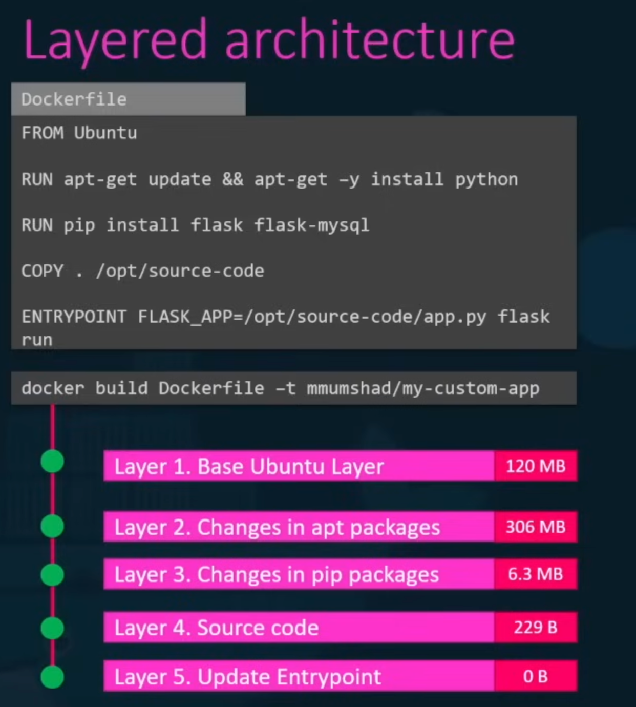

---

## ⚙️ Docker Engine (Remote Deployment)

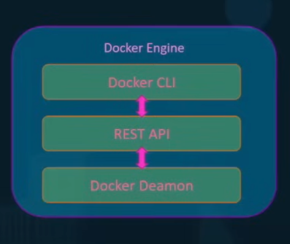

```bash
docker -H=192.168.1.123 run nginx

docker run --cpu=0.5 --memory=100m nginx
```

---

