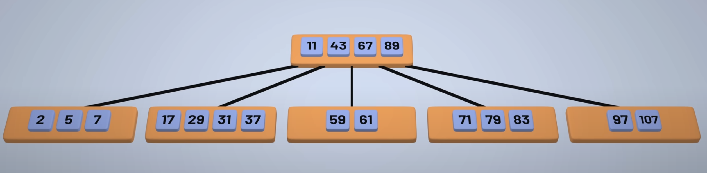

---

# 1. B Trees

## 🌳 Why Use `B-Trees` in Databases Over `Binary Search Trees`

Databases rely heavily on `disk-based storage`, where `I/O is the bottleneck`, not the CPU. This is where `B-Trees` shine over traditional `Binary Search Trees (BSTs)`.

### 🚀 Key Reason: Minimize `Disk I/O`

While processors are lightning fast, `fetching data from disk (especially spinning HDDs)` is `thousands of times slower` than in-memory access. Every node access in a tree stored on disk can result in a `costly disk read`.

### 🤔 Why Not `Binary Search Trees`?

- In `BSTs`, each node holds `only one key`.
- For a tree of height `h`, a search operation might require `O(h)` disk accesses.
- Trees can become `unbalanced`, increasing disk lookups even more.

### ✅ Advantages of `B-Trees`

| Feature                  | Description |
|--------------------------|-------------|
| `Multi-key nodes`      | Each `B-Tree` node holds `multiple keys and child pointers`. |
| `Wide nodes, short trees` | Fewer levels → `fewer disk reads` per operation. |
| `Balanced by design`   | `B-Trees` automatically rebalance on insertions and deletions. |
| `Optimized for disks`  | Nodes typically sized to fit a `disk block or memory page`. |

### 🔍 How `Search` Works in `B-Trees`

Each node contains an ordered list of keys:  
`[k1, k2, ..., kn]`

1. Search key is compared against all keys in the node.
2. Based on comparison:
   - ✅ If key matches → return
   - ⬅️ If smaller than `k1` → search leftmost subtree
   - 🔀 If between `ki` and `k(i+1)` → search middle subtree
   - ➡️ If greater than `kn` → search rightmost subtree
3. Repeat the process `recursively`.

### ✍️ `Insertions & Deletions`

- New keys are inserted into `leaf nodes`.
- If a node `overflows`:
  - It is `split` and the middle key is `pushed up`.
- Deletions may trigger `merges` or `redistributions` to maintain balance.
- All operations keep the tree `balanced and shallow`.

### 🌐 High `Fan-Out` = Fewer `Disk Accesses`

`B-Trees` can have `100s of children per node` (high `fan-out`), which drastically reduces tree height and minimizes disk reads.

### 🔎 Efficient `Range Queries`

`B/B+ Trees` support fast `in-order traversal`:
- Great for `ORDER BY`, `BETWEEN`, `LIKE 'abc%'`
- In `B+ Trees`, leaves are often `linked`, so scanning consecutive keys is efficient.

### 🌳 `B+ Trees` (Used in Modern DBs)

> A variant of `B-Trees` widely used in `databases` and `file systems`.

| Feature                | `B-Tree`      | `B+ Tree`     |
|------------------------|---------------|---------------|
| `Keys in internal nodes` | ✅         | ✅            |
| `Data stored`        | Internal & leaf | ⛔ Internal, ✅ Leaf only |
| `Efficient range queries` | Moderate | ✅ Excellent   |
| `Leaf node chaining` | Optional      | ✅ Required    |

🧠 Most modern `DB engines` (e.g., `MySQL InnoDB`, `PostgreSQL`, `Oracle`) use `B+ Trees` for their `clustered and secondary indexes`.

### 🛠 Real-World Usage

- `Databases`: `MySQL`, `PostgreSQL`, `MongoDB` (for indexes)
- `File Systems`: `NTFS`, `ext4`, `HFS+`
- `Search engines`: Use `B-Trees` or variants for indexing data on disk

### 📌 Visual Reference  

---

## 🧠 Interview Questions & Answers

### 1. **Why do databases prefer `B-Trees` over `Binary Search Trees`?**
Because `B-Trees` are `shallow` and have `high fan-out`, they `reduce costly disk I/O operations` — which is a major bottleneck in DB access patterns.

### 2. **What is the difference between a `B-Tree` and a `B+ Tree`?**  
- `B-Trees` store data in both `internal` and `leaf nodes`.  
- `B+ Trees` store data only in `leaf nodes` and `link the leaves` — making `range queries faster` and `sequential traversal easier`.

### 3. **Why are `B+ Trees` better for `range queries`?**  
Because the `leaf nodes are linked` (like a `linked list`), scanning a range of keys is `efficient` and doesn’t require traversing the tree repeatedly.

### 4. **What happens when a node in a `B-Tree` overflows?**  
The node is `split into two` and the `middle key is promoted` to the parent node. This keeps the tree `balanced`.

### 5. **How is a `B-Tree` optimized for `disk usage`?**  
Each node fits within a `disk block or memory page` and contains `multiple keys`, reducing the number of `disk reads` needed during traversal.

### 6. **What is `fan-out` in `B-Trees`? Why is it important?**  
`Fan-out` refers to the number of `child pointers` per node. A `high fan-out` means a `shallower tree` — leading to `fewer levels and disk accesses`.

### 7. **Can a `B-Tree` become unbalanced?**  
No. `B-Trees maintain balance` through `splitting and merging nodes` during `insertions and deletions`.

### 8. **What’s the complexity of `searching` in a `B-Tree`?**  
`O(logₙ N)`, where `n` is the number of keys per node. Since `n` is high (due to `wide nodes`), the `tree height is very small`.

---

